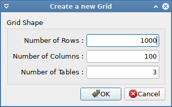
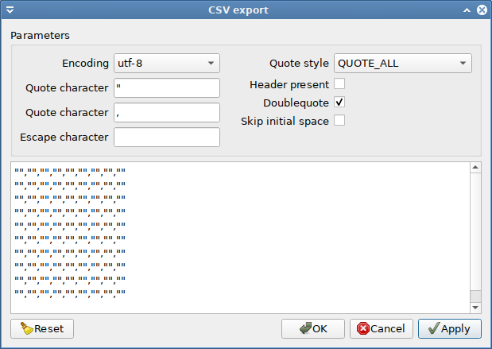
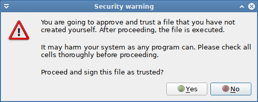
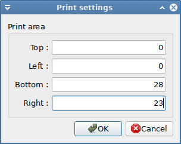
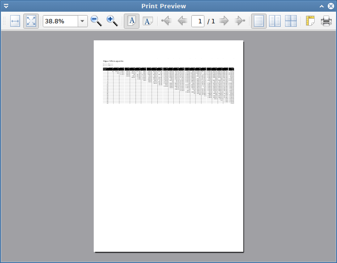

# File menu

## File → New



An empty spreadsheet can be created by **`File → New`**.

A Dialog pops up, in which the size of the new spreadsheet grid can be entered. Note
that grid size has been limited to 1 000 000 rows, 100 000 columns and 100 tables.

## File → Open

Loading a spreadsheet from disk can be initiated with **`File → Open`**. Opening a
file expects a file with the extension `.pysu` or `.pys`. The file format is *pyspread* specific. The formats differ only in `.pys` being a bzip2-compressed version of `.pysu`. `pysu` is the default option. It can be beneficial when using *pyspread* in combination with file version control systems such as git.

Since *pyspread* files are ultimately Python programs, a file is opened in safe mode if
it has not been previously signed with the key that is shown in the Preference dialog.

Safe mode means that the cell content is loaded and displayed in the grid but not executed, so that 2+2 remains 2+2 and is not computed into 4. You can leave safe mode with **`File → Approve file`**.

----------

## File → Save

A spreadsheet can be stored to disk with **`File → Save`** . If a file is already opened, it is
overwritten. Otherwise, Save prompts for a filename.

When a file is saved, it is signed in an additional file with the suffix `.sig` using the key that is shown in the Preference dialog. Note that the save file is not encrypted.

The `.pysu` file format is a UTF-8 Text file (without BOM) with the following structure (since version 0.2.0):

```
[Pyspread save file version]
2.0
[shape]
1000 100 3
[grid]
7 22 0 'Testcode1'
8 9 0 'Testcode2'
[attributes]
[] [] [] [] [(0, 0)]
0 'textfont' u'URW Chancery L'
[] [] [] [] [(0, 0)]
0 'pointsize' 20
[row_heights]
0 0 56.0
7 0 25.0
[col_widths]
0 0 80.0
[macros]
Macro text
```

## File → Save As
**`File → Save As`** saves the spreadsheet as does **`File → Save`**. While Save overwrites files that are opened on *pyspread* directly, Save As always always prompts for a file name.

----------

## File → Import


A csv file can be imported via `File → Import`.

If the selected file is not encoded in UTF-8, an encoding has to be chosen in a dialog. If the file is encoded in UTF-8 or if the chosen encoding can be read, the CSV file import dialog opens. In this dialog, CSV import options can be set. Furthermore, target Python types can be specified, so that import of dates becomes possible. The grid of the import dialog only shows the first few rows of the csv files in order to give an impression how import data will look like in *pyspread*.

Be careful when importing a file that contains code, because code in the CSV file might prove harmful.

For importing money data, it is recommended to use the decimal or the Money datatype. The latter supports specific currencies and requires the optional dependency [py-moneyed](https://pypi.org/project/py-moneyed/).

## File → Export

*pyspread* can export spreadsheets to `csv` files and `svg` files.

When exporting a file then a dialog is displayed, in which the area to be exported can be chosen.

When exporting a `.csv` file then an export dialog is shown next, in which the format of the csv file may be specified. The start of the exported file is shown below the options.



----------

## File → Approve file

*pyspread*  cells contain Python code. Instead of a special purpose language, you enter code in a general purpose language. This code can do everything that the operating system allows. Normally, this is a lot.

Even though the situation differs little to common spreadsheet applications, the approach makes malicious attacks easy. Instead of knowing how to circumvent blocks of the domain specific language to make the computer do what you want, everything is straight forward.

In order to make working with pyspread as safe as possible, all save-files (pys files and pysu files) are signed in a signature file. Only a user with a private key can open the file without approving it. That should ensure that when loading a pys file, only the code that a user has written him- or herself is executed. `.pys` files without a valid signatures are opened in safe mode, i. e. the code is displayed and not executed. However, it can be approved after inspection.



Therefore, never approve foreign `.pys` files unless you have checked thoroughly each cell. One cell may delete valuable files. And it is likely to be found somewhere in the middle of a million rows. If unsure, inspect the pys/pysu-file. It is a bzip2-ed text file. You can read it. You can grep in it. It may also be a good idea to run pyspread with a special user that has restricted privileges. If you like it even safer then use a sandbox. Chroot may be a good idea. Qemu / kvm are also worth a thought.

----------

## File → Clear globals

*pyspread* lets you define globals from within cells via `=` as well as via the macro editor. **Clear globals** deletes all globals but the initial set. This option frees memory and also gets rid of any globals that are set via macros. Afterwards, you have to re-apply the macros in order to have them available from within the spreadsheet.

----------

## File → Print preview

When selecting print preview, a dialog box is shown, in which the spreadsheet extents (rows, columns and tables) that should be printed can be selected.



After pressing o.k., a second dialog window displays the print preview.



## File → Print

**Print** prints the spreadsheet. First, a dialog similar to **Print preview** is opened, in which the spreadsheet extents (rows, columns and tables) can be selected. After pressing o.k., a operation system specific print dialog is opened. This dialog provided an option to start printing.

----------

## File → Preferences

The preferences dialog allows changing:

- **Signature key for files**: The private key that is used for signing the `.pys` and `.pysu` files
- **Cell calculation timeout**: If calculations for a cell exceed the time in seconds given here then calculation is aborted. This does not work for Python functions that are C code, so e.g. `2**99999999999999999` is not aborted.
- **Frozen cell refresh period**: If **`View → Toggle`** periodic updates is activated then all frozen cells are updated after a specified amount of time. This interval in milliseconds is set here. The change takes effect the next time that **`View → Toggle`** periodic updates is activated. Too small values may lock up the application.
- **Number of recent files**: The maximum number of files that is displayed in the list of recent files. Changes come into effect after the next restart of *pyspread*.


On *nix, configuration is stored in the file `~/.config/pyspread/pyspread.conf`
- This file is created when pyspread is started the first time
- Removing it resets configuration.

----------

## File → Quit

**`File → Quit`** exits pyspread. If changes have been made to a new or loaded file then a dialog pops up and asks if the changes shall be saved.
