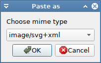
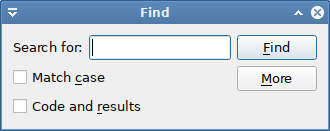

# Edit menu

## Edit → Undo

Most user actions in pyspread can be undone by **`Edit → Undo`** (Shortcut: `<Ctrl> + Z)`.
There is a list of undoable commands in the main toolbar.

## Edit → Redo

Undone steps can be redone with **`Edit → Redo`** . Also a shortcut with `<Shift> + <Ctrl> + Z`.

----------

## Edit → Cut

**`Edit → Cut`** behaves like **`Edit → Copy`** and pressing the `<Del>` key afterwards, i.e. the current cell code is copied and the cell is deleted. If cells are selected then the operations are applied to all cells in the bounding box of the marked cells.

## Edit → Copy

**`Edit → Copy`** copies cell code of the current cell (the one with the cursor) is copied. If multiple cells are selected then the copied set consists of the bounding box of the marked cells, i. e. the smallest box, in which all cells are situated. Cells that are not selected in that box are copied as if they were empty. The format of cells that are copied is tab separated Unicode.

## Edit → Copy results

**`Edit → Copy Results`** copies a string representation of the current cell’s result object. If e.g. the cell code of the current cell is 4*“a” then aaaa is copied to the Clipboard. As in **`Edit → Copy`**, if cells are selected then the copied set consists of the bounding box of the marked cells. Copy Results is useful, if for example results shall be copied into an external application.

## Edit → Paste

When pasting cells with **`Edit → Paste`**, these empty cells are pasted as well as the filled cells. That means that an unselected cell in a marked area will be pasted as empty cell.

Images can be inserted only via Paste As.

## Edit → Paste As

Different types of data can be pasted with **`Paste As`**. The keyboard shortcut is `<Shift> + <Ctrl> + V`.

The mimetype of the data to be pasted is chosen in a dialog. The data is then inserted and a renderer is chosen according to the mime type.

----------

## Edit → Find

Cell code and cell results can be searched with `<Ctrl> + F` or using the menu with **`Edit → Find`**. A dialog is opened, in which search queries can be entered. *pyspread* allows searching contained text, word-wise contained text and regular expressions, which can be toggled in the search toolbar. Toggle the `More` Button for extended options.

## Edit → Replace

Replacing is done via the **Find & Replace dialog** that is accessible via `<Shift> + <Ctrl> + F` or via **`Edit → Replace`**. Strings that are found are replaced with the replace string. Note that replace only allows searching in cell code and not in results.

----------

## Edit → Quote cell

Quote cells puts Unicode quotations around the cell code of each selected cell or the current cell if no selection is present. Quotations mean that the cell content is interpreted as a Python unicode object, i.e. `'` is put before the start and `'` at the end of the cell code. The keyboard shortcut is `<Crtl> + <Enter>`.

Quotation is not done if:
- there is no code in the cell or
- the character " appears in the code or
- the first and last character combination is any of: `""`, `''`, `u'`, `u"`

----------

## Edit → Insert rows

Inserts one row directly above the cursor if no selections are made. If selections are present, then the bounding box that covers all selected cells is calculated, and the number of rows of this bounding box is inserted above the bounding box.

## Edit → Insert columns

Inserts one column directly left of the cursor if no selections are made. If selections are present, then the bounding box that covers all selected cells is calculated, and the number of columns of this bounding box is inserted just left of the the bounding box.

## Edit → Insert table

Inserts one table directly before the current table and switches to this new table.

----------

## Edit → Delete rows

Deletes the cursor row if no selections are made. If selections are present, then all rows in the bounding box that covers all selected cells are deleted.

## Edit → Delete columns

Deletes the cursor column if no selections are made. If selections are present, then all columns in the bounding box that covers all selected cells are deleted.

## Edit → Delete table

Deletes the current table.

----------

## Edit → Resize grid

Changes the grid size. Similar to File → New, a dialog is shown, in which the new number of rows, columns and tables can be set. The grid size is changed accordingly. Cells that stay remain identical. Cells that are added are empty. Cells that are removed are deleted and cannot be accessed any more.
