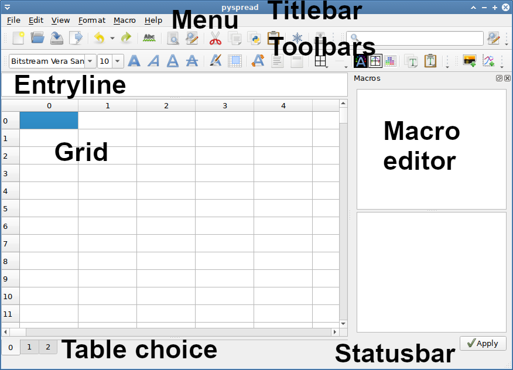

# The Workspace

## Starting and exiting pyspread

Type

`$ pyspread`

from the command prompt. 

If you want to run *pyspread* without installation then cd into the pyspread directory and type

`$ ./pyspread/pyspread.py`

You can also launch the file via a file manager (e.g. the Windows Explorer on Widnows).

You can exit pyspread by closing the main window or by selecting `File -> Quit` from the menu.

## pyspread main window

The main window comprises the following components (see Figure):

- Titlebar
- Menu
- Toolbars
- Entryline
- Grid
- Macro editor
- Table choice
- Statusbar

## Title bar

When *pyspread* is started or a new spreadsheet is created then the Titlebar displays "pyspread". When a file is opened or saved then the filename is presented in front of " - pyspread".

Whenever a spreadsheet is changed then an askerisk "*" is displayed in front of the Titlebar text.

## Menu

Since all actions of pyspread are available via the menu, the manual provides a section for each menu. The menu items do not change position or content when working with *pyspread*. However, the state of toggle actions changes e.g. when selcting a cell in the grid.

## Toolbars

Toolbars make a subset of actions quickly accessible. Status updates of toggle actions are visualized. Actions with multiple states such as the cell renderer choice are displayed with the icon of the current state. The state is changed by clicking on the button, which is indicated by a changed icon.

Toolbar content can be shown or hidden using the toolbar menu at the right side of each toolbar. The show/hide state is restored at the next start of *pyspread*.

## Entry line

Code may be entered into the grid cells via the entry line. The entry line can be detached, moved and attached at another location on the screen.

Code is accepted and evaluated when `<Enter>` is pressed. It is discarded when a new cell is selected. Multiple lines of code within one cell can be entered using `<Shift> + <Enter>`.

Code can also be entered by selecting a cell and then typing into the appearing cell editor. However, code highlighting and spell checking is displayed only in the entry line.

When data shall be displayed as text, it has to be quoted so that the code represents a Python string. In order to make such data entry easier, quotation is automatically added if `<Ctrl>+<Enter>` is pressed after editing a cell. If multiple cells are selected then `<Ctrl>+<Enter>` quotes all selected cells.

## Grid

#### Navigating the grid
The grid can be navigated via the arrow keys as well as using the scrollbars. Note that if a cell that is outside the view is newly selected, the view may jump to the cell.

#### Multiple views
The grid provides up to four views of the grid. These views can be accessed by dragging the splitters that initially reside at the lower and right corners of the grid. All views may be edited. Changes are immediately affecting all views. The relevant selection for editing the grid is always the view that is having focus. Note that it is not possible to have two views of two different tables at the same time.

#### Changing cell content
In order to change cell content, double-click on the cell or select the cell and edit the text in the entry line.

#### Deleting cell content
A cell can be deleted by selecting it and pressing `<Del>`. This also works for selections.

#### Selecting cells
Cells can be selected by the following actions:

- Keeping the left mouse button pressed while over cells selects a block
- Pressing `<Ctrl>` when left-clicking on cells selects these cells individually
- Clicking on row or column labels selects all cells of a row or column
- Pressing `<Ctrl> + A` selects all grid cells of the current table

Only cells of the current table can be selected at any time. Switching tables switches cell selections to the new table, i.e. the same cells in the new table are selected and no cells of the old table are selected.

Be careful when selecting all cells in a large table. Operations may take considerable time.

#### Secondary grid views
You can pull out up to 3 secondary grid views from the righr and the lower border of the grid.
These views display the same grid content but can be independently scrolled and zoomed
in order to effectively work in separated sections of large grids.

Note that actions that affect the grid such as formatting cells refer to the last focused grid.

## Macro editor

Macros can be edited from within the macro editor. The editor allows editing a
text file that is executed when the spreadsheet is opened or when its content is updated.

The Apply button executes the macro code. Output (including exceptions) are shown in the lower part of the macro editor.

The scope of macro execution is global. Therefore, all functions are directly accessible from each cell. For example, the function f that is displayed in the Figure can be called from a cell via f(). The result is the returned string “Hello, pyspread!”.

Since cell evaluation order is not guaranteed in pyspread, macros can be used for operations that enforce state. One example for such operations are some module imports such as rpy2. Furthermore, algorithms that are too complex for a single cell should be written as a macro.

## Table choice

Tables can be switched using the table choice. On right click, a context menu for insertion and deletion of tables is shown.

## Statusbar

Status and error messages may appear in the Statusbar. Safe mode is indicated with an attention icon `⚠`.
